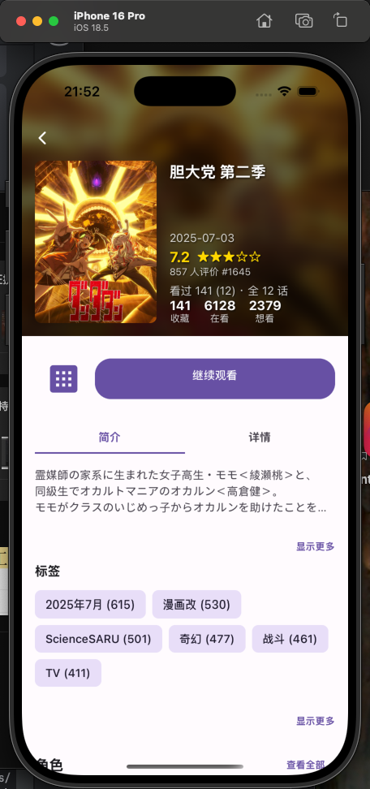
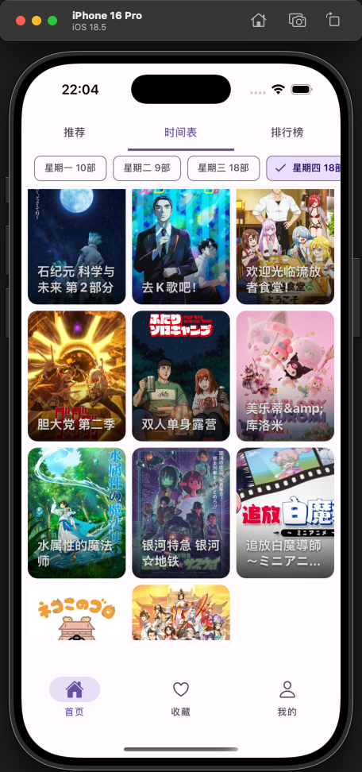
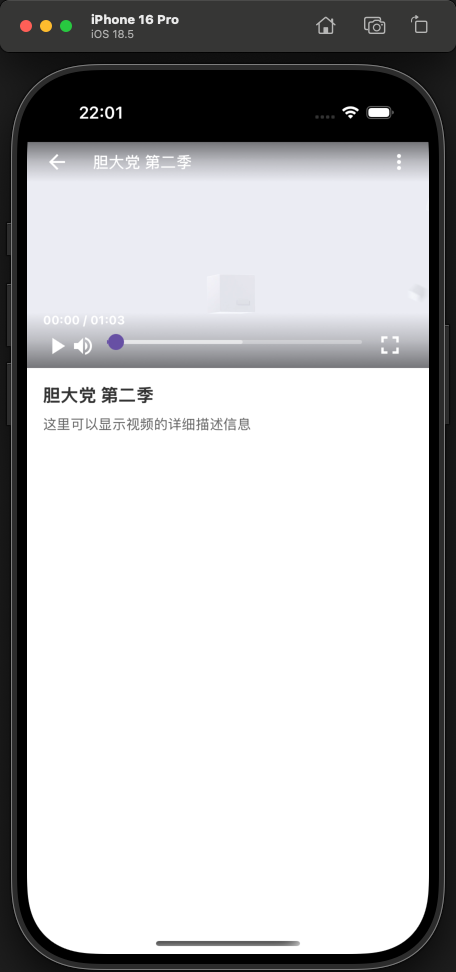

# 🎬 Anime Video Player(功能完善中)

一个功能强大、跨平台的React Native视频播放器应用，专为动漫视频播放体验而设计。

## ✨ 特性

### 🎮 播放控制

- **智能播放控制** - 播放/暂停、快进/快退、音量调节
- **进度条拖拽** - 支持手势拖拽快速定位播放位置
- **自动隐藏控件** - 播放时控件自动隐藏，提供沉浸式观看体验
- **缓冲进度显示** - 实时显示视频缓冲状态

### 📱 界面体验

- **全屏播放** - 支持横竖屏切换，自适应屏幕方向
- **Material Design** - 现代化UI设计，符合Material Design规范
- **渐变背景** - 优雅的渐变背景，提升视觉体验
- **触摸交互** - 点击视频区域显示/隐藏控件

### 🌐 跨平台支持

- **iOS** - 原生iOS体验
- **Android** - 完整Android支持
- **macOS** - 桌面端macOS应用(完善中)
- **Windows** - Windows桌面应用(完善中)

## 🛠️ 技术栈

- **React Native 0.79.4** - 跨平台移动应用框架
- **React Native Video** - 专业视频播放组件
- **React Native Reanimated** - 高性能动画库
- **React Navigation** - 导航管理
- **TypeScript** - 类型安全的JavaScript

## 📦 安装与运行

### 环境要求

- Node.js >= 18
- React Native CLI
- 对应平台的开发环境（Xcode、Android Studio等）

### 安装依赖

```bash
# 使用 yarn 安装依赖
yarn install

# iOS 依赖安装
cd ios && pod install && cd ..

# macOS 依赖安装
cd macos && pod install && cd ..
```

### 运行应用

```bash
# iOS
yarn ios

# Android
yarn android

# macOS
yarn macos

# Windows
yarn windows

# 开发服务器
yarn start
```

## 📸 应用截图

<div align="center">

|                             📱 动漫详情页面                             |                             📅 时间表页面                             |                           🎬 视频播放页面                           |
|:-----------------------------------------------------------------:|:----------------------------------------------------------------:|:-------------------------------------------------------------:|
|  |  |  |

</div>

## 🎯 核心功能

### 视频播放器组件

- 支持网络视频流播放
- 自动缓冲和错误处理
- 播放状态管理
- 音量和静音控制

### 控制界面

- 顶部导航栏（返回按钮、标题、更多选项）
- 底部控制栏（播放控制、进度条、全屏按钮）
- 智能显示/隐藏逻辑
- 手势交互支持

### 全屏模式

- 无缝全屏切换
- 屏幕方向自适应
- 全屏状态下的特殊交互逻辑

## 📁 项目结构

```
src/
├── ui/
│   └── video/
│       └── player/
│           ├── index.tsx          # 主播放器组件
│           ├── controls/          # 控制组件
│           │   ├── Controls.tsx   # 控制界面
│           │   └── style.ts       # 控制样式
│           ├── style.tsx          # 播放器样式
│           └── Config.ts          # 播放器配置
├── components/                    # 通用组件
├── navigation/                    # 导航配置
└── types/                        # 类型定义
```

## 🎨 设计特色

- **现代化UI** - 采用Material Design设计语言
- **流畅动画** - 基于React Native Reanimated的高性能动画
- **响应式布局** - 适配不同屏幕尺寸和方向
- **用户友好** - 直观的交互设计和视觉反馈

## 📄 许可证

本项目采用 MIT 许可证 - 查看 [LICENSE](LICENSE) 文件了解详情。

## 👨‍💻 作者

**[Ligg](https://github.com/LiggMax)** - 项目创建者和主要维护者

---

*为动漫爱好者打造的专业视频播放体验* 🌟